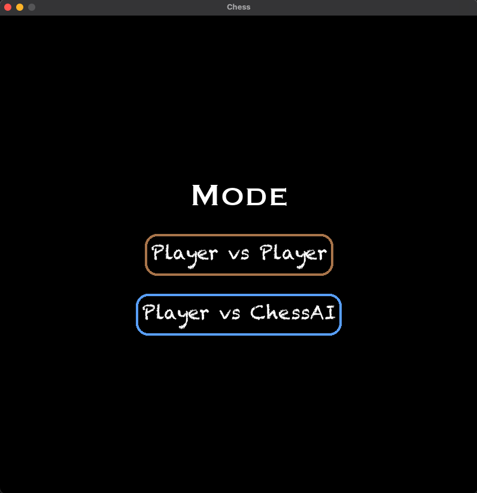
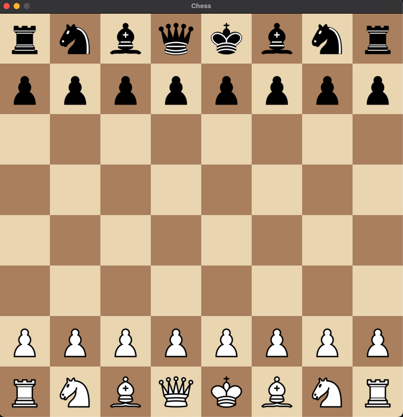

# ChessAI game using Alpha Beta pruning algorithm

## A fully functional chess engine with two modes - Player v Player and Player v AI.


The AI mode uses the **minimax algorithm with alpha beta pruning** to make the best move, thinking *5 moves ahead within reasonable time (usually 5 seconds)*. The evaluation function is based on the piece values and the position of the pieces on the board. Currently, the AI is not unbeatable, but it is quite a challenge for a beginner to intermediate player and definitely me.

Some of the features/optimisations made include:

- An attractive chess engines with two modes - **Player v Player and Player v AI**.

- Ability to **change themes of the board**.

- **Alpha Beta pruning** 

- **Zobrist hashing** for caching the board state to avoid repititive calculations.
    - Stores the best move for that state
    - Returns the stored move if depth is less than the current depth OR depending of the flag value updates alpha beta values to improve pruning.

- Evaluation function based on piece values.

- **Move ordering** prioritising on:
    - Captures
    - Positional advantage
    - Moving to squares that are not under attack
    - Pawn promotions

- Calculating and storing **attacked squares** for the board state to avoid illegal moves.
    - Some of these illegal moves are:
        - Moving a piece that is pinned
        - If king in check, moving a piece that does not block the check
        - Moving the king to an attacked square, leaving the king in check at end of turn

    - By calculating attacked squares, we made huge optimisations in time by considering these scenarios:
        - If a piece is blocking a check (pinned), we can only move it along the direction of the check.
        - If not in check, we can return all psuedo legal moves for all non-pinned pieces.
        - If in check,
            - if single check, we can either move the king or block the check with a non-pinned piece
            - if double check, we must move the king
            - if no legal moves, it is a checkmate
        - If not in check, 
            - if no legal moves, it is a stalemate

- An optimised **do and undo move function** to simulate the moves and revert them back for the AI to calculate the best move.

## How to install and run the game
- Git clone this repository
```
    git clone https://github.com/thejus03/ChessAI.git
```
- Change directory to the cloned repository
```
    cd ChessAI
```
- Create a virtual environment in the repository
```
    python -m venv venv
```
- Activate the virtual environment
```
    source venv/bin/activate
```
- Install the required packages
```
    pip install -r requirements.txt
```
- Run the scripts
    - To play the game
    ```
        ./scripts/run.sh
    ```
    - Troubleshooting
        - If you face and issue with executing the script, run the following command
        ```
            chmod +x scripts/run.sh
        ```
        - Then run the script again
        - Initially might take a few seconds (~30 seconds) to boot up pygame

## How to play the game
- The game starts with a page where user can select the mode of the game - Player v Player or Player v AI.


- To change themes, click `t` on the keyboard.
- To quit the game, click `Ctrl + c` on the keyboard.
- To restart the game, click `r` on the keyboard. 
- To make a move, just click on the piece and drag it to the desired square.
